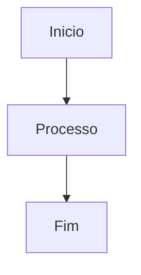
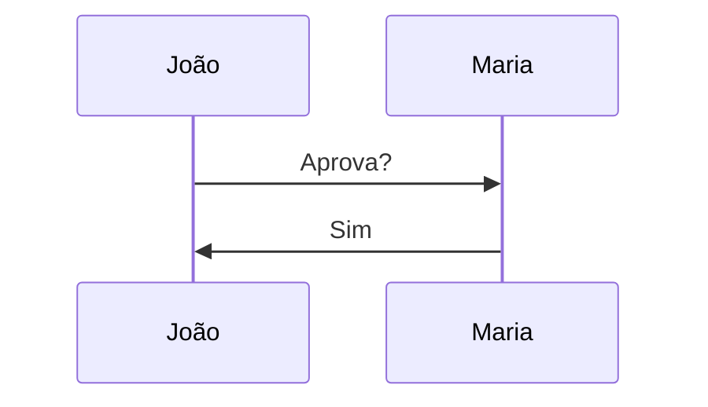

---
{"dg-publish":true,"permalink":"/sintaxe-do-obsidian-guia-pratico/","dg-note-properties":{}}
---

> Este guia mostra **a sintaxe**, **o resultado** e **quando usar** cada recurso.

---

# 1. TÍTULOS

## Sintaxe

```md
# Projeto de Férias
## Cronograma
### Etapa 1
```

## Resultado

# Projeto de Férias

## Cronograma

### Etapa 1

## Uso

Organizar a estrutura das notas.

---

# 2. FORMATAÇÃO DE TEXTO

## Negrito

```md
**Importante**
```

Resultado:

**Importante**

---

## Itálico

```md
*Observação*
```

Resultado:

_Observação_

---

## Negrito + Itálico

```md
***Urgente***
```

Resultado:

_**Urgente**_

---

## Riscado

```md
~~Cancelado~~
```

Resultado:

~~Cancelado~~

---

## Destaque

```md
==Prazo amanhã==
```

Resultado:

==Prazo amanhã==

---

## Código

```md
`Apps Script`
```

Resultado:

`Apps Script`

---

# 3. LISTAS

## Lista simples

```md
- RH
- DAP
- Compras
```

Resultado:

- RH
- DAP
- Compras

---

## Lista hierárquica

```md
- Projeto
  - Planejamento
  - Execução
```

Resultado:

- Projeto
    - Planejamento
    - Execução

---

## Lista numerada

```md
1. Solicitação
2. Aprovação
3. Execução
```

Resultado:

1. Solicitação
2. Aprovação
3. Execução

---

# 4. TAREFAS

## Sintaxe

```md
- [ ] Elaborar relatório
- [x] Atualizar planilha
```

Resultado:

- [ ] Elaborar relatório
- [x] Atualizar planilha

## Uso

O Obsidian permite marcar/desmarcar clicando na caixa.

---

# 5. LINKS EXTERNOS

## Sintaxe

```md
[Portal do Servidor](https://servidor.gov.br)
```

Resultado:

[Portal do Servidor](https://servidor.gov.br)

---

# 6. WIKILINKS (SUPERPODER DO OBSIDIAN)

## Criar link para outra nota

```md
[[Férias 2026]]
```

Se existir uma nota chamada "Férias 2026", ela será aberta.

Se não existir, o Obsidian cria o link e permite criar a nota depois.

---

## Alias

```md
[[Férias 2026|Plano de Férias]]
```

Resultado visual:

Plano de Férias

---

## Link para seção

Nota:

```md
# Projeto

## Cronograma
```

Link:

```md
[[Projeto#Cronograma]]
```

Vai abrir diretamente nessa seção.

---

# 7. EMBEDS (INCORPORAR CONTEÚDO)

## Mostrar outra nota dentro da nota atual

```md
![[Projeto]]
```

Resultado:

Conteúdo da nota Projeto aparece dentro da nota atual.

---

## Mostrar apenas uma seção

```md
![[Projeto#Cronograma]]
```

Resultado:

Somente a seção Cronograma aparece.

---

# 8. REFERÊNCIAS DE BLOCO

## Criar bloco

```md
Prazo final: 30/06/2026
^prazo
```

## Referenciar

```md
[[Projeto#^prazo]]
```

## Incorporar

```md
![[Projeto#^prazo]]
```

### Resultado

Mostra apenas aquele trecho específico.

Muito útil para dashboards.

---

# 9. TAGS

## Simples

```md
#ferias
```

---

## Hierárquicas

```md
#projeto

#projeto/dap

#projeto/dap/ferias
```

### Vantagem

Ao pesquisar:

```text
#projeto
```

Você encontra tudo.

---

# 10. TABELAS

## Sintaxe

```md
| Nome | Setor | Status |
|------|------|------|
| João | DAP | Ativo |
| Maria | RH | Férias |
```

Resultado:

|Nome|Setor|Status|
|---|---|---|
|João|DAP|Ativo|
|Maria|RH|Férias|

---

# 11. CALLOUTS

## Nota

```md
> [!note]
> Informação importante.
```

Resultado:

Caixa visual destacada.

---

## Dica

```md
> [!tip]
> Use templates.
```

---

## Aviso

```md
> [!warning]
> Prazo vence amanhã.
```

---

## Erro

```md
> [!danger]
> Não excluir esta planilha.
```

---

## Recolhível

```md
> [!info]+ Detalhes
> Texto oculto.
```

Abre expandido.

---

```md
> [!info]- Detalhes
> Texto oculto.
```

Abre fechado.

---

# 12. CITAÇÕES

```md
> Texto citado
```

Resultado:

> Texto citado

---

# 13. COMENTÁRIOS

## Não aparecem na visualização

```md
%% Informação interna %%
```

---

## Multilinha

```md
%%
Anotação
privada
%%
```

---

# 14. FRONTMATTER

Fica no topo da nota.

```yaml
---
title: Projeto Férias

aliases:
  - Ferias

tags:
  - projeto
  - ferias

created: 2026-06-08
---
```

## Para que serve?

- Metadados
- Busca
- Dataview
- Organização

---

# 15. NOTAS DE RODAPÉ

## Sintaxe

```md
Texto importante[^1]

[^1]: Explicação detalhada.
```

Resultado:

Texto importante¹

---

# 16. IMAGENS

## Inserir

```md
![[imagem.png]]
```

---

## Redimensionar

```md
![[imagem.png|300]]
```

300 px de largura.

---

## Definir largura e altura

```md
![[imagem.png|300x200]]
```

---

# 17. PDF

## Incorporar

```md
[[manual.pdf]]
```

---

## Página específica

```md
![[manual.pdf#page=3]]
```

---

# 18. ÁUDIO

```md
![[audio.mp3]]
```

Cria player de áudio.

---

# 19. VÍDEO

```md
![[video.mp4]]
```

Cria player de vídeo.

---

# 20. CÓDIGO

## Inline

```md
`const x = 10`
```

Resultado:

`const x = 10`

---

## Bloco

````md
```javascript
function teste() {
 return true;
}
```
````

Resultado:

```javascript
function teste() {
 return true;
}
```

---

# 21. LATEX (MATEMÁTICA)

## Fórmula inline

```md
$E=mc^2$
```

Resultado:

E = mc²

---

## Fórmula em bloco

```md
$
E=mc^2
$
```

---

## Fração

```md
$
\frac{a}{b}
$
```

---

## Matriz

```md
$
\begin{bmatrix}
1 & 2\\
3 & 4
\end{bmatrix}
$
```

---

# 22. MERMAID (DIAGRAMAS)

## Fluxograma

````md

````

Resultado:

Início → Processo → Fim

---

## Sequência

````md

````

---

# 23. HTML

## Área recolhível

```html
<details>
<summary>Clique aqui</summary>

Conteúdo oculto

</details>
```

---

## Teclas

```html
<kbd>Ctrl</kbd> + <kbd>P</kbd>
```

Resultado:

Ctrl + P

---

# 24. ESCAPAR CARACTERES

Mostrar Markdown sem executar:

```md
\# Título

\*Texto\*

\[Nota\]
```

Resultado:

# Título

_Texto_

[[Nota]]

---

# 25. DASHBOARD EXEMPLO

```md
# Dashboard

## Projetos

- [[Projeto RH\|Projeto RH]]
- [[Projeto DAP\|Projeto DAP]]

## Tarefas

- [ ] Revisar relatório
- [ ] Atualizar planilha

## Última reunião

![[Reunião#Resumo\|Reunião#Resumo]]
```

Resultado:

Uma página central que reúne várias notas.

---

# 26. FLUXO IDEAL DE ORGANIZAÇÃO

```text
Projetos/
├── Projeto RH
├── Projeto DAP

Áreas/
├── RH
├── DAP

Pessoas/
├── João
├── Maria

Reuniões/
├── Reunião 2026-06-08
```

Tags:

```md
#projeto
#area
#pessoa
#reuniao
```
