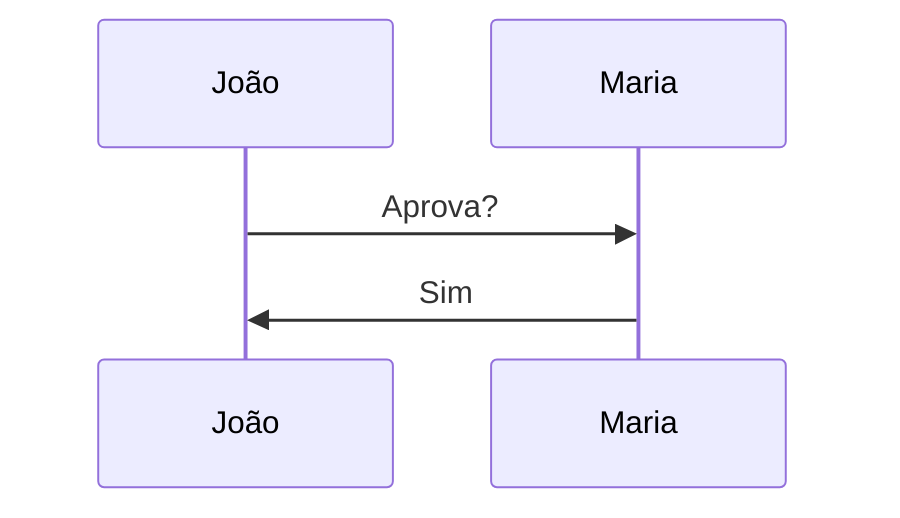

---
{"dg-publish":true,"permalink":"/sintaxe-do-obsidian-guia-pratico/","dg-note-properties":{}}
---


> Referência rápida de Markdown + recursos nativos do Obsidian..

---

# Formatação Básica

|Recurso|Sintaxe|
|---|---|
|Título 1|`# Título`|
|Título 2|`## Título`|
|Título 3|`### Título`|
|Negrito|`**texto**`|
|Itálico|`*texto*`|
|Negrito + Itálico|`***texto***`|
|Riscado|`~~texto~~`|
|Destaque|`==texto==`|
|Código inline|`` `texto` ``|
|Subscrito|`H~2~O`|
|Sobrescrito|`X^2^`|
|Linha horizontal|`---`|

---

# Listas

|Recurso|Sintaxe|
|---|---|
|Item|`- Item`|
|Subitem|`- Subitem`|
|Numerada|`1. Item`|
|Tarefa|`- [ ] Fazer`|
|Concluída|`- [x] Feito`|

---

# Links

|Recurso|Sintaxe|
|---|---|
|Link externo|`[Texto](https://site.com)`|
|URL direta|`https://site.com`|
|E-mail|`<email@dominio.com>`|

---

# Tabelas

Tabela simples:

```text
| Nome | Setor |
|------|------|
| João | DAP |
| Maria | RH |
```

Alinhamento:

|Tipo|Sintaxe|
|---|---|
|Esquerda|`:---`|
|Centro|`:---:`|
|Direita|`---:`|

---

# Comentários

|Recurso|Sintaxe|
|---|---|
|Linha única|`%% comentário %%`|
|Multilinha|`%% ... %%`|

---

# Notas de Rodapé

|Recurso|Sintaxe|
|---|---|
|Referência|`Texto[^1]`|
|Definição|`[^1]: Observação`|

---

# Wikilinks

```text
[[Projeto]]

[[Projeto|Meu Projeto]]

[[Projeto#Cronograma]]

[[Projeto#^prazo]]
```

---

# Embeds

```text
![[Projeto]]

![[Projeto#Cronograma]]

![[Projeto#^prazo]]
```

---

# Referências de Bloco

Criar bloco:

```text
Prazo final: 30/06/2026
^prazo
```

Usar:

```text
[[Projeto#^prazo]]

![[Projeto#^prazo]]
```

---

# Tags

```text
#projeto

#projeto/dap

#projeto/dap/ferias
```

---

# Callouts

Tipos disponíveis:

```text
note
abstract
info
todo
tip
success
question
warning
failure
danger
bug
example
quote
```

Nota:

```text
> [!note]
> Conteúdo
```

Dica:

```text
> [!tip]
> Conteúdo
```

Aviso:

```text
> [!warning]
> Conteúdo
```

Perigo:

```text
> [!danger]
> Conteúdo
```

Recolhível aberto:

```text
> [!info]+ Detalhes
> Conteúdo
```

Recolhível fechado:

```text
> [!info]- Detalhes
> Conteúdo
```

---

# Imagens e Arquivos

Imagem:

```text
![[imagem.png]]
```

Redimensionar:

```text
![[imagem.png|300]]
```

Largura x Altura:

```text
![[imagem.png|300x200]]
```

PDF:

```text
[[arquivo.pdf]]
```

Página específica:

```text
![[arquivo.pdf#page=5]]
```

Áudio:

```text
![[audio.mp3]]
```

Vídeo:

```text
![[video.mp4]]
```

---

# Código

Inline:

```text
`const x = 10`
```

Bloco:

````text
```javascript
const x = 10;
```
````

Linguagens comuns:

```text
javascript
typescript
python
sql
json
yaml
bash
powershell
html
css
```

---

# Frontmatter

```text
---
title: Projeto Férias

aliases:
  - Ferias

tags:
  - projeto
  - ferias

created: 2026-06-08

updated: 2026-06-08
---
```

---

# LaTeX

Inline:

```text
$E=mc^2$
```

Bloco:

```text
$
E=mc^2
$
```

Fração:

```text
\frac{a}{b}
```

Somatório:

```text
\sum_{i=1}^{n}
```

Integral:

```text
\int_a^b
```

Raiz:

```text
\sqrt{x}
```

Matriz:

```text
\begin{bmatrix}
1 & 2\\
3 & 4
\end{bmatrix}
```

---

# Mermaid

Tipos:

```text
flowchart
sequenceDiagram
classDiagram
erDiagram
stateDiagram-v2
journey
timeline
pie
gantt
```

Fluxograma:

````text

````

Sequência:

````text

````

---

# HTML Útil

Recolhível:

```text
<details>
<summary>Clique aqui</summary>

Conteúdo

</details>
```

Teclas:

```text
<kbd>Ctrl</kbd> + <kbd>P</kbd>
```

Quebra de linha:

```text
<br>
```

---

# Query Blocks

Buscar tag:

```text
tag:#projeto
```

Buscar pasta:

```text
path:"Projetos"
```

Buscar texto:

```text
ferias
```

---

# Escapar Caracteres

```text
\*texto\*

\#tag

\[\[Nota\]\]

\|
```
