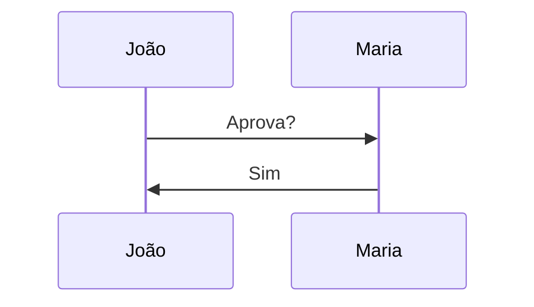

---
{"dg-publish":true,"permalink":"/sintaxe-do-obsidian-guia-pratico/","dg-note-properties":{}}
---

> Referência rápida. Procure o recurso na coluna "Função" e copie a sintaxe.

|Categoria|Função|Sintaxe|
|---|---|---|
|Texto|Negrito|`**texto**`|
|Texto|Itálico|`*texto*`|
|Texto|Negrito + Itálico|`***texto***`|
|Texto|Riscado|`~~texto~~`|
|Texto|Destacado|`==texto==`|
|Texto|Código inline|`` `texto` ``|
|Texto|Subscrito|`H~2~O`|
|Texto|Sobrescrito|`X^2^`|
|Estrutura|Título 1|`# Título`|
|Estrutura|Título 2|`## Título`|
|Estrutura|Título 3|`### Título`|
|Estrutura|Linha horizontal|`---`|
|Lista|Item|`- Item`|
|Lista|Subitem|`- Subitem`|
|Lista|Numerada|`1. Item`|
|Lista|Tarefa|`- [ ] Fazer`|
|Lista|Concluída|`- [x] Feito`|
|Link|Externo|`[Texto](https://site.com)`|
|Link|URL direta|`https://site.com`|
|Link|E-mail|`<email@dominio.com>`|
|Obsidian|Nota|`[[Projeto]]`|
|Obsidian|Nota com alias|`[[Projeto\|Meu Projeto]]`|
|Obsidian|Cabeçalho|`[[Projeto#Cronograma]]`|
|Obsidian|Cabeçalho com alias|`[[Projeto#Cronograma\|Cronograma]]`|
|Obsidian|Bloco|`[[Projeto#^prazo]]`|
|Obsidian|Nota incorporada|`![[Projeto]]`|
|Obsidian|Seção incorporada|`![[Projeto#Cronograma]]`|
|Obsidian|Bloco incorporado|`![[Projeto#^prazo]]`|
|Obsidian|Criar bloco|`Texto importante
{ #bloco}
`|
|Tags|Tag simples|`#projeto`|
|Tags|Tag hierárquica|`#projeto/dap`|
|Tags|Tag multinível|`#projeto/dap/ferias`|
|Citação|Simples|`> Texto`|
|Citação|Aninhada|`>> Texto`|
|Callout|Nota|`> [!note]`|
|Callout|Informação|`> [!info]`|
|Callout|Dica|`> [!tip]`|
|Callout|Aviso|`> [!warning]`|
|Callout|Perigo|`> [!danger]`|
|Callout|Sucesso|`> [!success]`|
|Callout|Pergunta|`> [!question]`|
|Callout|Erro/Bug|`> [!bug]`|
|Callout|Citação|`> [!quote]`|
|Callout|Expansível aberto|`> [!info]+ Título`|
|Callout|Expansível fechado|`> [!info]- Título`|
|Tabela|Básica|`\| Col1 \| Col2 \|`|
|Tabela|Alinhar esquerda|`:---`|
|Tabela|Alinhar centro|`:---:`|
|Tabela|Alinhar direita|`---:`|
|Rodapé|Referência|`Texto[^1]`|
|Rodapé|Definição|`[^1]: Observação`|
|Comentário|Linha única|`%% comentário %%`|
|Comentário|Multilinha|`%% ... %%`|
|Imagem|Inserir|`![[imagem.png]]`|
|Imagem|Largura|`![[imagem.png\|300]]`|
|Imagem|Largura x Altura|`![[imagem.png\|300x200]]`|
|PDF|Inserir|`[[arquivo.pdf]]`|
|PDF|Página específica|`![[arquivo.pdf#page=5]]`|
|Áudio|Inserir|`![[audio.mp3]]`|
|Vídeo|Inserir|`![[video.mp4]]`|
|Código|Bloco|` ```linguagem ``` `|
|Código|JS|` ```javascript ``` `|
|Código|SQL|` ```sql ``` `|
|Código|JSON|` ```json ``` `|
|Código|YAML|` ```yaml ``` `|
|Matemática|Fórmula inline|`$E=mc^2$`|
|Matemática|Fórmula bloco|`$$ fórmula $$`|
|Matemática|Fração|`\frac{a}{b}`|
|Matemática|Somatório|`\sum_{i=1}^{n}`|
|Matemática|Integral|`\int_a^b`|
|Matemática|Matriz|`\begin{bmatrix}...\end{bmatrix}`|
|Mermaid|Fluxograma|`flowchart TD`|
|Mermaid|Sequência|`sequenceDiagram`|
|Mermaid|Classe|`classDiagram`|
|Mermaid|Gantt|`gantt`|
|Mermaid|ERD|`erDiagram`|
|Mermaid|Timeline|`timeline`|
|Mermaid|Jornada|`journey`|
|HTML|Recolhível|`<details>`|
|HTML|Título recolhível|`<summary>`|
|HTML|Quebra linha|`<br>`|
|HTML|Destacar|`<mark>`|
|HTML|Tecla|`<kbd>Ctrl</kbd>`|
|Escape|Asterisco literal|`\*texto\*`|
|Escape|Tag literal|`\#tag`|
|Escape|Wikilink literal|`\[\[Nota\]\]`|
|Query|Buscar tag|` ```query tag:#projeto ``` `|
|Query|Buscar pasta|` ```query path:"Projetos" ``` `|
|Query|Buscar texto|` ```query férias ``` `|

---

# Frontmatter (Metadados)

```yaml
---
title: Projeto Férias

aliases:
  - Ferias

tags:
  - projeto
  - ferias

created: 2026-06-08

updated: 2026-06-08
---
```

---

# Tipos de Callout

```text
note
abstract
info
todo
tip
success
question
warning
failure
danger
bug
example
quote
```

---

# Mermaid — Exemplos Mínimos

## Fluxograma


## Sequência



## Gantt

```mermaid
gantt
title Projeto
```

---

# LaTeX — Exemplos Úteis

Fração:

```latex
\frac{a}{b}
```

Somatório:

```latex
\sum_{i=1}^{n}
```

Integral:

```latex
\int_a^b
```

Matriz:

```latex
\begin{bmatrix}
1 & 2\\
3 & 4
\end{bmatrix}
```
