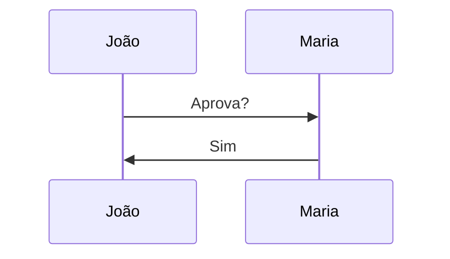

---
{"dg-publish":true,"permalink":"/sintaxe-do-obsidian-guia-pratico/","dg-note-properties":{}}
---

> Referência compacta para uso diário. Sintaxes simples ficam em tabela. Sintaxes complexas possuem exemplos próprios.

---

## Formatação Básica

| Recurso           | Sintaxe      |
| ----------------- | ------------ |
| Título 1          | # Título     |
| Título 2          | ## Título    |
| Título 3          | ### Título   |
| Negrito           | **texto**    |
| Itálico           | _texto_      |
| Negrito + Itálico | _**texto**_  |
| Riscado           | ~~texto~~    |
| Destaque          | ==texto==    |
| Código inline     | `texto`      |
| Subscrito         | H~2~O        |
| Sobrescrito       | X^2^         |
| Linha horizontal  | ---          |
| Quebra de linha   | texto</code> |

---

## Listas e Tarefas

| Recurso        | Sintaxe     |
| -------------- | ----------- |
| Item           | - Item      |
| Subitem        | - Subitem   |
| Lista numerada | 1. Item     |
| Tarefa         | - [ ] Fazer |
| Concluída      | - [x] Feito |

---

## Links

|Recurso|Sintaxe|
|---|---|
|Link externo|[Texto](https://site.com/)|
|URL direta|[https://site.com](https://site.com/)|
|E-mail|<[email@dominio.com](mailto:email@dominio.com)>|

---

## Wikilinks (Obsidian)

| Recurso           | Sintaxe                            |
| ----------------- | ---------------------------------- |
| Nota              | [[Projeto\|Projeto]]                        |
| Alias             | [[Projeto\|Meu Projeto]]           |
| Cabeçalho         | [[Projeto#Cronograma\|Projeto#Cronograma]]             |
| Cabeçalho + Alias | [[Projeto#Cronograma\|Cronograma]] |
| Bloco             | [[Projeto#^prazo\|Projeto#^prazo]]                 |

### Exemplo

```md
[[Projeto RH]]

[[Projeto RH|Projeto Recursos Humanos]]

[[Projeto RH#Cronograma]]

[[Projeto RH#^prazo]]
```

---

## Embeds (Incorporação)

|Recurso|Sintaxe|
|---|---|
|Nota|![[Projeto\|Projeto]]|
|Seção|![[Projeto#Cronograma\|Projeto#Cronograma]]|
|Bloco|![[Projeto#^prazo\|Projeto#^prazo]]|

### Exemplo

```md
![[Projeto RH]]

![[Projeto RH#Cronograma]]

![[Projeto RH#^prazo]]
```

---

## Referências de Bloco

Criar bloco:

```md
Prazo final: 30/06/2026
^prazo
```

Usar:

```md
[[Projeto#^prazo\|Projeto#^prazo]]

![[Projeto#^prazo\|Projeto#^prazo]]
```

---

## Tags

|Recurso|Sintaxe|
|---|---|
|Simples|#projeto|
|Hierárquica|#projeto/dap|
|Multinível|#projeto/dap/ferias|

---

## Callouts

|Tipo|Sintaxe|
|---|---|
|Nota|> [!note]|
|Info|> [!info]|
|Dica|> [!tip]|
|Sucesso|> [!success]|
|Aviso|> [!warning]|
|Perigo|> [!danger]|
|Pergunta|> [!question]|
|Bug|> [!bug]|
|Citação|> [!quote]|

### Expansível

Aberto:

```md
> [!info]+ Detalhes
> Conteúdo
```

Fechado:

```md
> [!info]- Detalhes
> Conteúdo
```

---

## Tabelas

Tabela simples:

```md
| Nome | Setor |
|------|------|
| João | DAP |
| Maria | RH |
```

Alinhamento:

|Tipo|Sintaxe|
|---|---|
|Esquerda|:---|
|Centro|:---:|
|Direita|---:|

---

## Comentários

|Recurso|Sintaxe|
|---|---|
|Linha única||
|Multilinha||

---

## Notas de Rodapé

|Recurso|Sintaxe|
|---|---|
|Referência|Texto[^1]|
|Definição|[^1]: Observação|

---

## Imagens e Arquivos

|Recurso|Sintaxe|
|---|---|
|Imagem|![[imagem.png\|imagem.png]]|
|Redimensionar|![[imagem.png\|300]]|
|Largura x Altura|![[imagem.png\|300x200]]|
|PDF|[[arquivo.pdf\|arquivo.pdf]]|
|Página PDF|![[arquivo.pdf#page=5\|arquivo.pdf#page=5]]|
|Áudio|![[audio.mp3\|audio.mp3]]|
|Vídeo|![[video.mp4\|video.mp4]]|

---

## Código

|Recurso|Sintaxe|
|---|---|
|Bloco genérico|```|
|JavaScript|```javascript|
|Python|```python|
|SQL|```sql|
|JSON|```json|
|YAML|```yaml|

Exemplo:

````md
```javascript
const nome = "João";
```
````

---

## Frontmatter

```yaml
---
title: Projeto Férias

aliases:
  - Ferias

tags:
  - projeto
  - ferias

created: 2026-06-08

updated: 2026-06-08
---
```

---

## LaTeX

|Recurso|Sintaxe|
|---|---|
|Fórmula inline|$E=mc^2$|
|Fórmula bloco|$$ fórmula $$|
|Fração|\frac{a}{b}|
|Somatório|\sum_{i=1}^{n}|
|Integral|\int_a^b|
|Raiz|\sqrt{x}|
|Matriz|\begin{bmatrix}...\end{bmatrix}|

Exemplo:

```latex
$
\frac{a}{b}
$
```

---

## Mermaid

|Tipo|Sintaxe|
|---|---|
|Fluxograma|flowchart TD|
|Sequência|sequenceDiagram|
|Classe|classDiagram|
|ERD|erDiagram|
|Estado|stateDiagram-v2|
|Jornada|journey|
|Timeline|timeline|
|Pizza|pie|
|Gantt|gantt|

Fluxograma:

````md

````

Sequência:

````md

````

---

## HTML Útil

|Recurso|Sintaxe|
|---|---|
|Recolhível|<details>|
|Título recolhível|<summary>|
|Quebra de linha|<br>|
|Destaque|<mark>|
|Tecla|<kbd>Ctrl</kbd>|

---

## Escapar Caracteres

|Recurso|Sintaxe|
|---|---|
|Asterisco|*texto*|
|Tag|#tag|
|Wikilink|[[Nota\|Nota]]|
|Pipe|\||

---

## Query Blocks

|Recurso|Sintaxe|
|---|---|
|Buscar tag|tag:#projeto|
|Buscar pasta|path:"Projetos"|
|Buscar texto|ferias|
